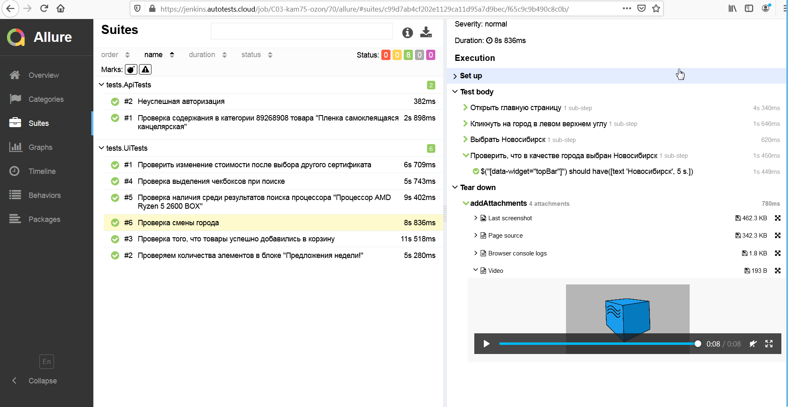
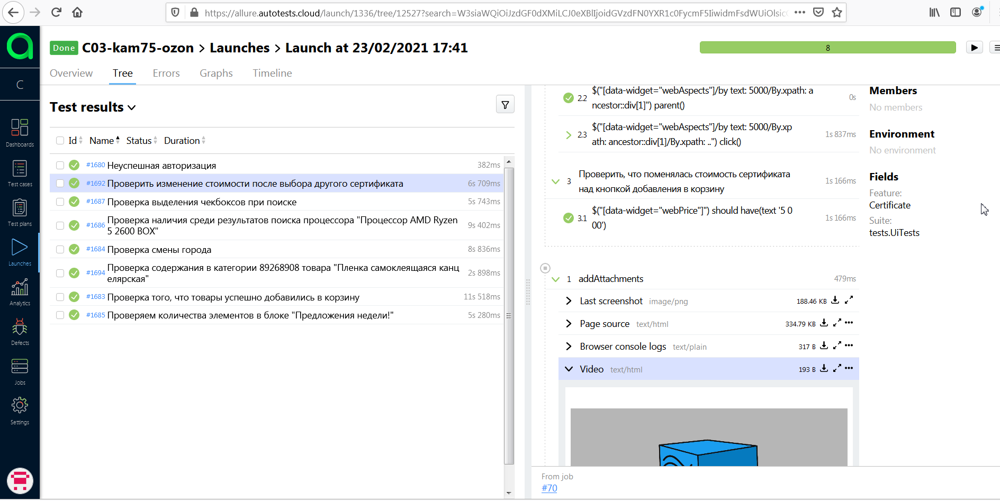

# Ozon tests

Jenkins: https://jenkins.autotests.cloud/job/C03-kam75-ozon/  
Allure Report: https://jenkins.autotests.cloud/job/C03-kam75-ozon/allure

## Использованные инструменты:
* Java
* Gradle
* JUnit5
* Selenide
* Jenkins
* Selenoid
* Allure Report
* Allure TestOps(EE)
* Telegram Notifications
* Owner
* Jira

## Скриншоты

### Selenoid
***

### Allure Report 
***

### Allure TestOps (EE) 
***

### Jira
***

### Telegram Notifications
***

